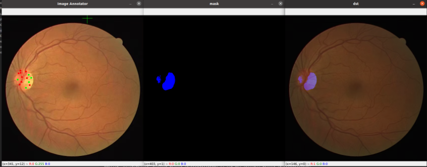
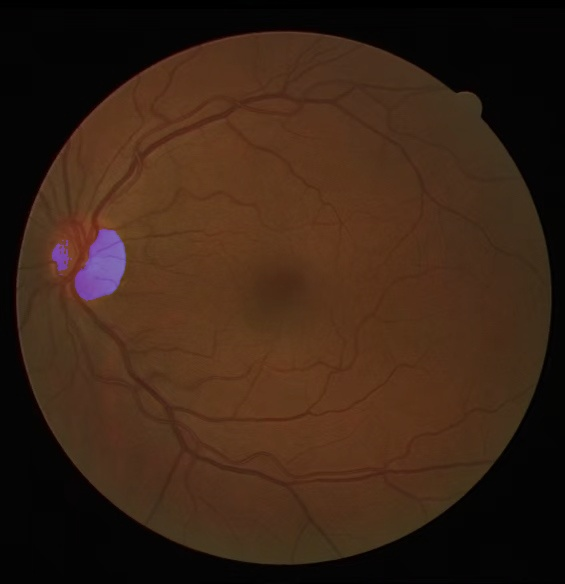

# image_processing_homework
## Author RangerOnMars guhao0521@gmail.com
## 1. Introduction
This repo is a simple implementation for SAU Digital Image Processing Homework2 -- Optic Disk Segmentation by using segment-anything Python API.
## 2. Installation
1. Install requirements.
```bash
pip install requirements.txt
```
2. Download segment-anything ViT weight.
```bash
cd model
wget https://dl.fbaipublicfiles.com/segment_anything/sam_vit_l_0b3195.pth
cd ..
```

## 3. Usage
```bash
python main.py
```
The image will be shown in `Image Annotator` Window, Press `mouse left button` to add foreground point(shown in green), `mouse middle button` to add background point(shown in red).



Press `Enter` to preview and the image will be saved in `result.jpg`.


